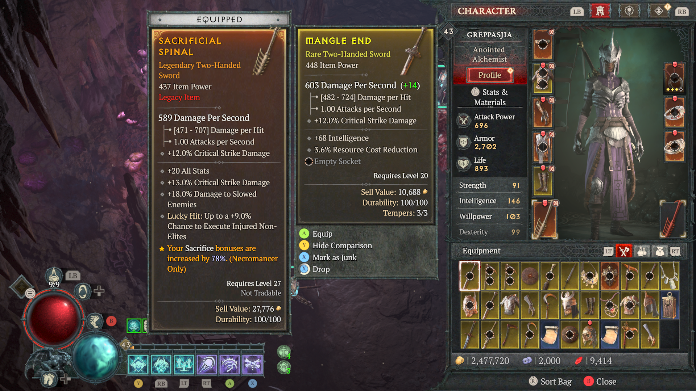
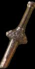
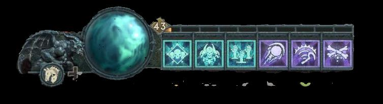
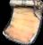

# image_video_parser

llamaindex node parsing for images and video content

## Setup

1. Clone the repository:
    ```sh
    git clone https://github.com/your-repo/image_video_parser.git
    cd image_video_parser
    ```

2. Install CUDA (if necessary) and required Python packages:
    ```sh
    ./setup.sh
    ```

3. Create a `.env` file with your Azure OpenAI credentials:
    ```sh
    echo "AZURE_OPENAI_API_KEY=your_api_key" > .env
    echo "AZURE_OPENAI_ENDPOINT=your_endpoint" >> .env
    echo "MODEL=gpt-4o-mini" >> .env
    echo "API_VERSION=2023-03-15-preview" >> .env
    ```

## Running the Script

To run the main script and use the `diablo_menu.png` image:

1. Ensure the `diablo_menu.png` image is located in the `./images/` directory.

2. Run the script:
    ```sh
    python main.py
    ```

The script will process the `diablo_menu.png` image, generate bounding boxes, segment the image, and save the results in the `./output/segmented_images/` directory.

You can find pre-computed examples in the `examples` folder.

## Original Menu Image



### Segmented Outputs

  |  
-----------|-----------
 |  


